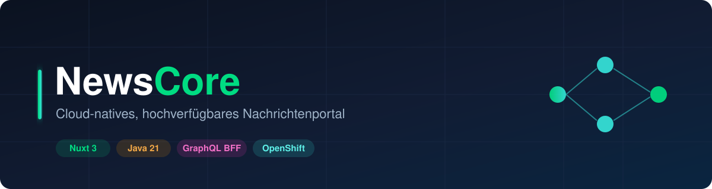
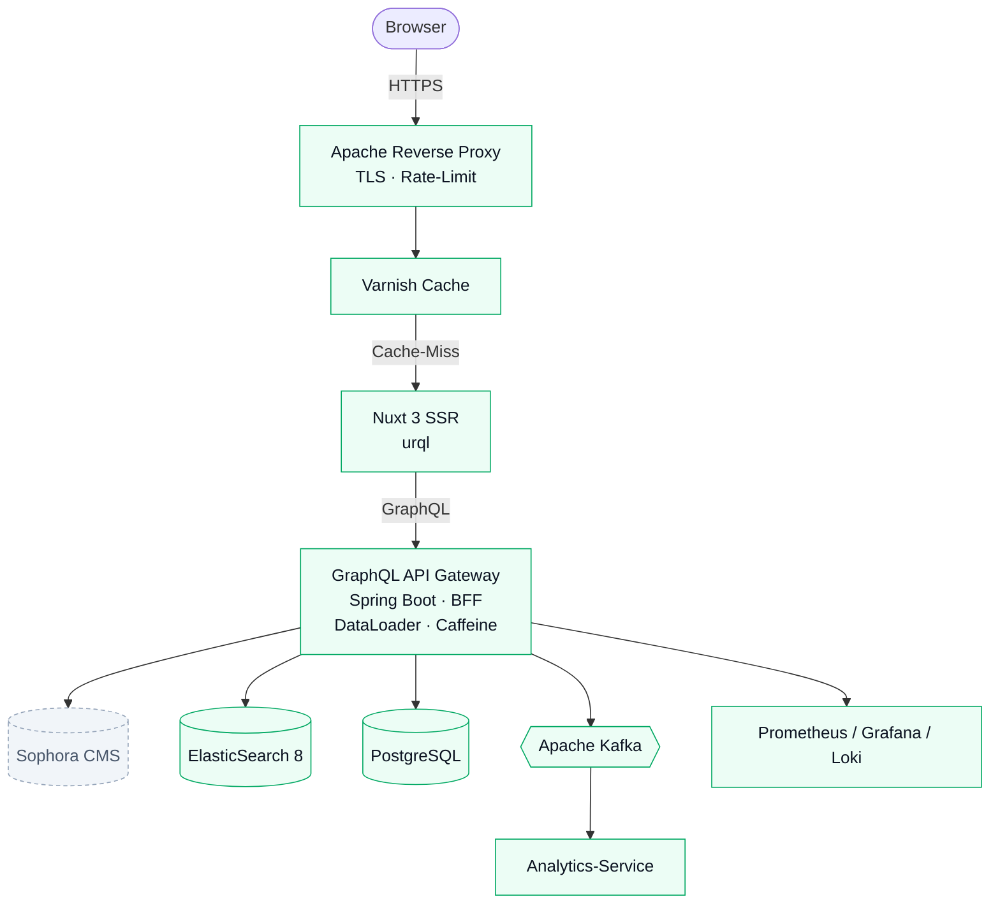

# NewsCore



[](.gitlab-ci.yml)
[](apps/api-gateway)
[](apps/frontend)
[](https://nuxt.com)
[](https://openjdk.org)
[](apps/api-gateway)
[](LICENSE)

> **NewsCore** ist ein cloud-natives, hochverfügbares Nachrichtenportal: redaktionelle Inhalte aus
> einem CMS, ausgeliefert über eine GraphQL-API (Backend-for-Frontend) an ein server-seitig
> gerendertes Nuxt-3-Frontend — ausgelegt für High-Traffic und GitOps-Betrieb auf OpenShift/Kubernetes.

## 📑 Inhaltsverzeichnis

- [Highlights](#-highlights)
- [Features](#-features)
- [Architektur](#-architektur)
- [Quick Start](#-quick-start)
- [Teststrategie](#-teststrategie)
- [CI/CD Pipeline](#-cicd-pipeline)
- [Projektstruktur](#-projektstruktur)
- [Defect Management](#-defect-management)
- [Architecture Decision Records](#-architecture-decision-records)
- [Roadmap](#-roadmap)

## ⭐ Highlights

- **Lauffähiger Vertical Slice in einem Befehl** — `docker compose up --build` startet GraphQL-Gateway + SSR-Frontend.
- **N+1-frei by design** — nested `author`/`category` werden per DataLoader (`@BatchMapping`) gebatcht.
- **Austauschbare Datenquelle** — Resolver kennen nur Service-Interfaces; Mock heute, Sophora/ElasticSearch morgen, ohne Resolver-Änderung.
- **Hohe Testabdeckung, in CI erzwungen** — Backend **98 %**, Frontend **96 %** (Gate ≥ 80 %).
- **Dokumentierte Entscheidungen** — jede Technologiewahl als [ADR](docs/adr/).

## ✨ Features

| Feature                         | Status | Technologie                              | Anmerkung |
|---------------------------------|:------:|------------------------------------------|-----------|
| GraphQL-BFF-Gateway             |   ✅   | Spring Boot 3, `spring-graphql`, Java 21 | Schema-first |
| N+1-Vermeidung                  |   ✅   | DataLoader via `@BatchMapping`           | author + category |
| Application-Cache               |   ✅   | Caffeine (`@Cacheable`)                  | [ADR-003](docs/adr/ADR-003-caffeine-caching.md) |
| SSR-Frontend                    |   ✅   | Nuxt 3, Vue 3, TypeScript                | `useAsyncData` |
| GraphQL-Client                  |   ✅   | urql (`ssrExchange`)                     | [ADR-001](docs/adr/ADR-001-graphql-client-urql.md) |
| Edge-Caching                    |   ✅   | Varnish (VCL) + Apache (TLS/gzip/Header) | [ADR-008](docs/adr/ADR-008-varnish-caching.md), event-getriebenes PURGE |
| Volltextsuche                   |   ✅   | ElasticSearch 8 (Profil-gesteuert)       | [ADR-004](docs/adr/ADR-004-elasticsearch-search.md), Testcontainers |
| Event-Streaming                 |   ✅   | Kafka: Producer/Consumer + DLQ           | [ADR-005](docs/adr/ADR-005-kafka-eventing.md), EmbeddedKafka |
| Aktive Cache-Invalidierung      |   ✅   | `article.events` → ES-Reindex + Evict    | schließt den Loop zu ADR-003 |
| Analytics → PostgreSQL          |   ✅   | analytics-service (Node, kafkajs + pg)   | `search.events` + `user.events` (Pageviews) → Postgres |
| Observability-Endpoint          |   ✅   | Actuator + `/actuator/prometheus`        | Grafana folgt |
| Lokales Stack-Setup             |   ✅   | docker-compose (ES + Kafka + Postgres)   | ein Befehl |
| CI-Pipeline                     |   ✅   | GitLab CI (5 Stages)                     | Coverage-Gate |
| K8s/OpenShift + GitOps          |   ✅   | Helm-Umbrella-Chart + ArgoCD             | [ADR-006](docs/adr/ADR-006-helm-argocd-gitops.md), HPA/PDB/NetworkPolicy |
| Observability                   |   ✅   | Prometheus + Grafana + Loki              | [ADR-007](docs/adr/ADR-007-observability.md), Dashboards/Alerts/JSON-Logs |
| Distributed Tracing             |   ✅   | OpenTelemetry + Tempo (OTLP)             | [ADR-009](docs/adr/ADR-009-distributed-tracing.md), Trace↔Logs-Korrelation |

## 🏗 Architektur



Grün = in dieser Iteration umgesetzt · gestrichelt = vorgesehen (Roadmap).
Begründung der zentralen Schicht: [ADR-002 — GraphQL BFF](docs/adr/ADR-002-graphql-bff-pattern.md).

## 🚀 Quick Start

### Variante A — Komplettes Stack (Docker)

```bash
docker compose up --build
# Frontend:  http://localhost:3000
# GraphiQL:  http://localhost:8080/graphiql
```

### Variante B — Apps einzeln (lokal)

```bash
# Terminal 1 — API-Gateway (Maven Wrapper lädt Maven beim ersten Lauf)
cd apps/api-gateway && ./mvnw spring-boot:run

# Terminal 2 — Frontend
cd apps/frontend && npm install && npm run dev
```

### Hooks aktivieren (nach dem Clone)

```bash
git config core.hooksPath .githooks
chmod +x .githooks/*
```

## 🎯 Teststrategie

Strikte Testpyramide — Bulk an Unit-Tests, gezielte Integrationstests, wenige E2E (Roadmap):

```
        ┌────────────────────┐
        │   E2E (Playwright) │   🔜 Roadmap
        ├────────────────────┤
        │  Integrationstests │   GraphQlTester · Testcontainers (ES) · EmbeddedKafka
        ├────────────────────┤
        │     Unit-Tests     │   JUnit 5 · Vitest  (Bulk)
        └────────────────────┘
```

| Schicht           | Tooling                                         | Umfang                       |
|-------------------|-------------------------------------------------|------------------------------|
| Backend           | JUnit 5, Mockito, AssertJ                       | 41 Unit-Tests                |
| Backend           | `GraphQlTester`, Testcontainers (ES), EmbeddedKafka | 11 Integrationstests     |
| Frontend          | Vitest, Vue Test Utils, happy-dom               | 16 Tests                     |
| analytics-service | Vitest (gemockt: kafkajs + pg)                  | 9 Tests                      |

```bash
cd apps/api-gateway          && ./mvnw verify                        # Backend: Tests + JaCoCo-Gate
cd apps/frontend             && npm run test:unit -- --run --coverage
cd services/analytics-service && npm run test:unit -- --run --coverage
```

Coverage-Gate **≥ 80 %** in allen Modulen erzwungen (Frontend ~95 %, analytics-service 100 % der
Logik-Schicht). Flaky-Test-Policy: [FLAKY-TESTS.md](FLAKY-TESTS.md).

## 🔁 CI/CD Pipeline

GitLab CI ([.gitlab-ci.yml](.gitlab-ci.yml)) mit fünf Stages und pfadbasierten `rules`:

```
validate ─→ test ─→ build ─→ security ─→ deploy-staging ─→ deploy-prod (manuell)
 lint        unit/IT   images     trivy      ArgoCD sync       ArgoCD sync
```

- **validate** — ESLint + `type-check` (Frontend), Checkstyle (Backend)
- **test** — Unit + Integration, Coverage als Report/Artifact
- **build** — Container-Images → Registry (nur `main`/`develop`)
- **security** — Trivy-Scan, kein Merge bei HIGH/CRITICAL CVEs
- **deploy** — GitOps via ArgoCD (Staging automatisch, Prod manuelles Gate)

## 📁 Projektstruktur

```
newscore/
├── apps/
│   ├── api-gateway/        # Spring Boot 3 · GraphQL BFF · ES · Kafka (eigene README)
│   └── frontend/           # Nuxt 3 · urql · SSR (eigene README)
├── services/
│   └── analytics-service/  # Node/TS · Kafka → PostgreSQL (eigene README)
├── infrastructure/
│   ├── helm/newscore/      # Umbrella-Chart (Deploy/Svc/HPA/PDB/Ingress/NetworkPolicy/ServiceMonitor)
│   ├── argocd/             # ArgoCD Application-Manifeste (staging/prod)
│   ├── prometheus/         # Scrape-Config + Alert-Rules
│   ├── grafana/            # Provisioning (Datasources) + Dashboards
│   ├── loki/               # Promtail-Config (Log-Aggregation)
│   ├── varnish/            # default.vcl (Edge-Cache, TTLs, PURGE)
│   └── apache/             # Reverse-Proxy (TLS/gzip/Security-Header)
├── docs/
│   ├── adr/                # Architecture Decision Records
│   ├── defects/            # Defect-Template + Bugs
│   └── images/banner.svg
├── .githooks/              # pre-commit · commit-msg · pre-push
├── docker-compose.yml      # lokales Stack-Setup (ES + Kafka + Postgres)
├── .gitlab-ci.yml          # CI-Pipeline
├── CONTRIBUTING.md · FLAKY-TESTS.md · LICENSE
└── README.md
```

## 🐞 Defect Management

Bugs werden in [`docs/defects/`](docs/defects/) nach dem
[Defect-Template](docs/defects/DEFECT-TEMPLATE.md) dokumentiert (Severity, Repro-Schritte,
Root Cause, Regressionstest).

## 📐 Architecture Decision Records

| ADR | Entscheidung |
|-----|--------------|
| [ADR-001](docs/adr/ADR-001-graphql-client-urql.md) | urql als GraphQL-Client im Frontend |
| [ADR-002](docs/adr/ADR-002-graphql-bff-pattern.md) | GraphQL-Gateway nach BFF-Pattern |
| [ADR-003](docs/adr/ADR-003-caffeine-caching.md) | Caffeine als In-Process-Cache |
| [ADR-004](docs/adr/ADR-004-elasticsearch-search.md) | ElasticSearch als Volltextsuche (Profil-gesteuert) |
| [ADR-005](docs/adr/ADR-005-kafka-eventing.md) | Kafka-Eventing mit JSON-Serialisierung + DLQ |
| [ADR-006](docs/adr/ADR-006-helm-argocd-gitops.md) | Helm-Umbrella-Chart + ArgoCD-GitOps |
| [ADR-007](docs/adr/ADR-007-observability.md) | Observability mit Prometheus, Grafana und Loki |
| [ADR-008](docs/adr/ADR-008-varnish-caching.md) | Varnish-Edge-Cache + Apache-Reverse-Proxy |
| [ADR-009](docs/adr/ADR-009-distributed-tracing.md) | Distributed Tracing mit OpenTelemetry + Tempo |

## 🛣 Roadmap

- ✅ **Volltextsuche:** ElasticSearch-`SearchService` (profil-gesteuert, Testcontainers) — erledigt
- ✅ **Eventing (Epic 4):** Kafka-Producer/Consumer, DLQ, aktive Cache-Invalidierung, Analytics → Postgres — erledigt
- ✅ **Plattform (Epic 5):** Helm-Umbrella-Chart, ArgoCD-Apps, HPA/PDB, NetworkPolicies (OpenShift) — erledigt
- ✅ **Observability (Epic 6):** Prometheus-Scrape/Alerts, Grafana-Dashboards, JSON-Logs → Loki — erledigt
- ✅ **Caching (Epic 3):** Varnish-VCL + Apache-Proxy, event-getriebenes `PURGE` — erledigt
- ✅ **Tracing:** OpenTelemetry + Tempo (OTLP), Trace↔Logs-Korrelation — erledigt
- **Eventing-Ausbau:** Avro + Schema-Registry, `user.pageview`-Producer im Frontend
- **Datenanbindung:** Sophora-CMS-Resolver für die `*Service`-Interfaces
- **Frontend:** GraphQL-Codegen, Playwright-E2E, i18n, PWA

## 📄 Lizenz

[MIT](LICENSE)
